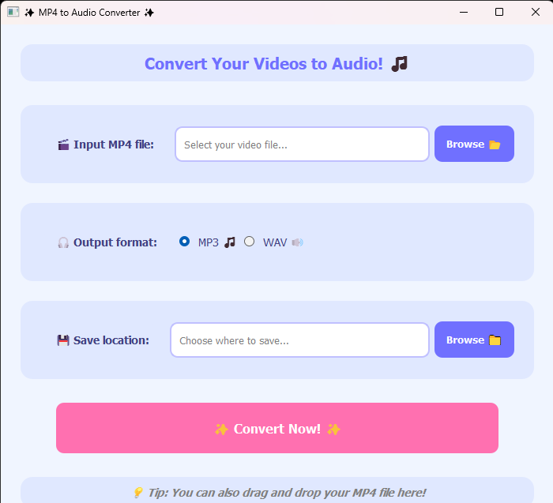

# MP4 to MP3/WAV Converter

A simple application to convert MP4 video files to MP3 or WAV audio formats using a PyQt5 GUI.

<div align="center">
  
</div>

## Features

- Drag and drop MP4 files into the application
- Browse for MP4 files using the file dialog
- Choose between MP3 and WAV output formats
- Select custom save location for the converted files
- Simple and easy-to-use interface
- Auto-rename, skip, or overwrite handling for existing files

## Requirements

- Python 3.6+
- PyQt5
- ffmpeg-python
- ffmpeg must be installed on your system and available in PATH

## Installation

1. Clone this repository or download the source code

2. Install the required Python packages:
   ```
   pip install -r requirements.txt
   ```

3. Make sure ffmpeg is installed on your system:
   - **Windows**: Download from [ffmpeg.org](https://ffmpeg.org/download.html) and add to PATH
   - **macOS**: Install with Homebrew: `brew install ffmpeg`
   - **Linux**: Install with your package manager, e.g., `sudo apt install ffmpeg`

## Usage

1. Run the application:
   ```
   python main.py
   ```

2. Add an MP4 file using one of these methods:
   - Click "Browse" and select an MP4 file
   - Drag and drop an MP4 file into the application window

3. Select your desired output format (MP3 or WAV)

4. Choose where to save the converted file by clicking the "Browse" button next to "Save location"

5. Click "Convert" to start the conversion process

6. A success message will appear when the conversion is complete

## Creating an Executable

You can create a standalone executable (.exe) file using PyInstaller:

1. Install PyInstaller:
   ```
   pip install pyinstaller
   ```

2. Use the provided spec file to build the executable:
   ```
   pyinstaller converter.spec
   ```

3. Alternatively, you can create a new executable with a single command:
   ```
   pyinstaller --noconsole --onefile --name "MP4 to Audio Converter" main.py
   ```

4. The executable will be created in the `dist` folder

5. **Important**: Users still need to have ffmpeg installed on their system and added to their PATH

### Customizing the Executable

- To add an icon to your application, create an .ico file and add the following to the PyInstaller command:
  ```
  pyinstaller --noconsole --onefile --icon=youricon.ico --name "MP4 to Audio Converter" main.py
  ```

- Or edit the converter.spec file and add the icon parameter to the EXE section

## Troubleshooting

- If you encounter errors related to ffmpeg, ensure it's properly installed and available in your system PATH
- For file permission errors, make sure you have write access to the save location
- If the executable doesn't work, try running from source using Python directly 
